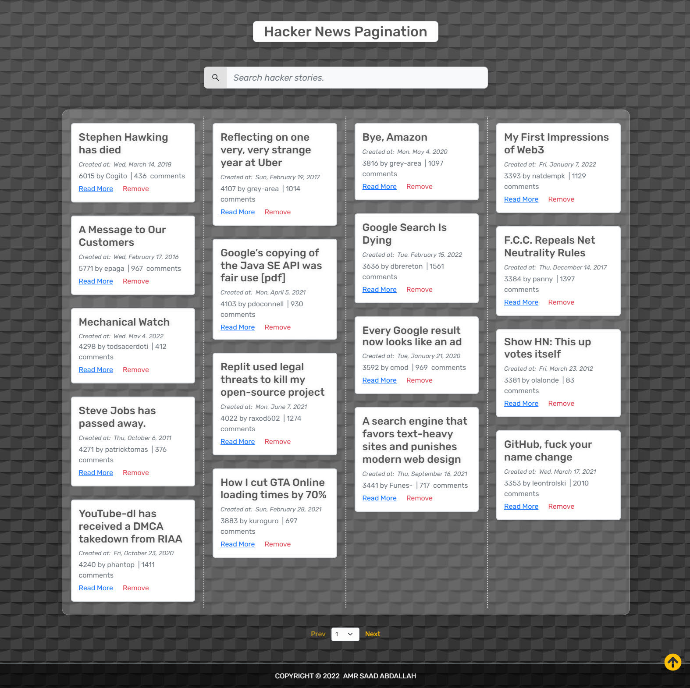
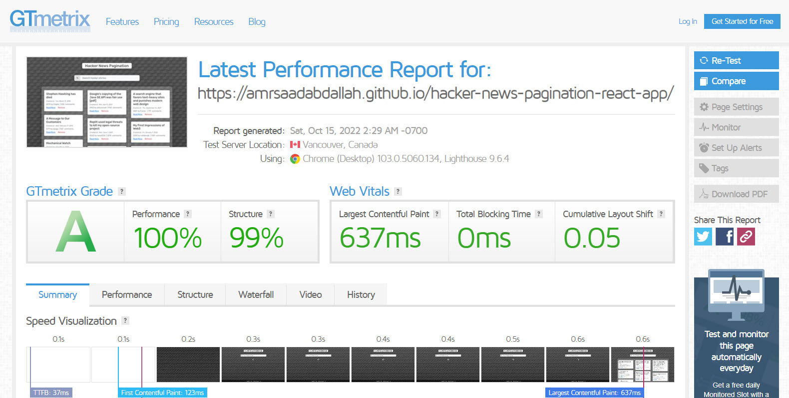

<h1 align="center" >Hacker News Pagination &mdash; React App  </h1>

### 👁️ Project Preview:

- [ Live Preview 👉 https://amrsaadabdallah.github.io/hacker-news-pagination-react-app](https://amrsaadabdallah.github.io/hacker-news-pagination-react-app)

- [ Github Repo 👉 https://github.com/amrsaadabdallah/my-hacker-news-pagination-react-app](https://github.com/amrsaadabdallah/my-hacker-news-pagination-react-app)
    - 🚩 It's a private repo <a target="_blank" href="mailto:amrsaadabdallah@gmail.com">contact me </a>to see.

---

### 📝 Project Description & features:

- It's a medium react app (Hacker News Pagination) used to practice react features.

- I use [HN Search API | HN Search powered by Algolia](https://hn.algolia.com/api)
which builts on top of Algolia Search's API. It enables developers to access HN data programmatically using a REST API.

- The API URL (`https://hn.algolia.com/api/v1/search?query=${searchWord}&page=${currentPageNumber}`).

- When page load it's fetch Hacker News by using  API Url with default search Info (searchWord: "",   currentPageNumber: 0)

- News pages pagination handles with backend  by fetching the news page by the selected page number.

- It's allowed to get news for any topic you need by entering it in the input field.

- Pagination has multiple looks if number of pages is less or wqual than 4 will be buttons and otherwise will be a dropdown menu.

- Note: HN Search API: specifications

    - In some cases the fetched news has a empty title so I handle to show news wihic has a title.

    - In some cases the fetched news has a empty url so in this case see read more button will n't appear.

---

### 🛠️ Project Tools:

1. Used Google Fonts.

1. Bootstrap Classes for styling.

1. ReactJS Library.

1. [HN Search API | HN Search powered by Algolia](https://hn.algolia.com/api).

1. PropTypes package for typechecking component props.

1. Random paragraphs list get from local file called data.

1. [GTmetrix](https://gtmetrix.com/) is an online tool for customers to easily test the performance of their webpages.

---

### :sparkles: Project Skills applied:

1. Create Multiple React Component.

1. Configuration react component by props.

1. Render List of items.

1. Apply Conditional Rendering.

1. Deal with form.

1. Fetching Hacker News from [HN Search API | HN Search powered by Algolia](https://hn.algolia.com/api).

1. Use React Hook (UseState, useEffect).

1. Preview Hakcker news with MASONRY layout by using [CSS ONLY WITH "CSS MULTIPLE COLUMN LAYOUT](https://codepen.io/xtinadelamo/pen/JRwWEd).

1. Typechecking component props With PropTypes package.

1. Test the performance of the webpage after deploy by using [GTmetrix](https://gtmetrix.com/).

---

### 🧪 Project performance test:

Test the performance of the webpage after deploy by using [GTmetrix](https://gtmetrix.com/).

---

### 👋 Get In Touch:

- [🌐 Website 👉 https://amrsaadabdallah.github.io](https://amrsaadabdallah.github.io)
- [👔 LinkedIn 👉 https://www.linkedin.com/in/amrsaadabdallah](https://www.linkedin.com/in/amrsaadabdallah)
- [🌟 Github 👉 https://github.com/amrsaadabdallah](https://github.com/amrsaadabdallah)
- [📧 Gmail 👉 amrsaadabdallah@gmail.com](mailto:amrsaadabdallah@gmail.com)
- [🐤 Twitter 👉 https://twitter.com/amrsaadabdallah](https://twitter.com/amrsaadabdallah)
- [:phone: Whatsapp 👉 (+20) 109-775-6067](https://api.whatsapp.com/send/?phone=%2B2001097756067&text&type=phone_number&app_absent=0)

---

<a target="_blank" href="https://amrsaadabdallah.github.io">

 2022 &copy; Amr Saad Abdallah 

</a>

